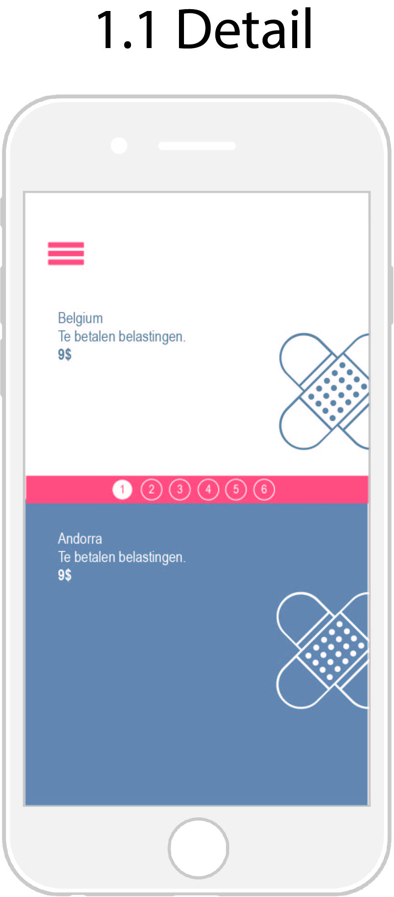

#LifeAbroad

##Groepsleden
--------------------------------
* Kristof Lettens
* Alexander Pauwelyn

##Briefing & Analyse

LifeAbroad is een applicatie die zich hoofdzakelijk richt op mensen die in het buitenland willen gaan wonen/werken/studeren of mensen die op reis willen en informatie over bepaalde landen willen inwinnen om zo te kunnen beslissen waar ze naartoe willen. De informatie voorhanden moet zeer variërend zijn en zal alle vragen van de gebruiker beantwoorden. Deze kan lopen van de veiligheid in het land tot de werkgelegenheid. Deze informatie zal op een interactieve manier naar voor worden gebracht.

##Technische specificaties

----------------------------------
###Webtechnologieën
De opbouw van onze website zal bestaan uit html5, css3 en javascript.

Gebruikte datasets:

* [Total unemployment](http://data.worldbank.org/indicator/SL.UEM.TOTL.NE.ZS)
* [Population density](http://data.worldbank.org/indicator/EN.POP.DNST)
* [Forest area](http://data.worldbank.org/indicator/AG.LND.FRST.ZS)
* Life expectancy
	* [Life expectancy at birth (male)](http://data.worldbank.org/indicator/SP.DYN.LE00.MA.IN)
	* [Life expectancy at birth (female)](http://data.worldbank.org/indicator/SP.DYN.LE00.FE.IN)
* [Internet users)](http://data.worldbank.org/indicator/IT.NET.USER.P2)
* [Cause of death, by injury](http://data.worldbank.org/indicator/SH.DTH.INJR.ZS)

##Persona's

----------------------------------

**Isabelle Degroot** – Isabelle is een sportieve duizendpoot van begin de 40. Oorspronkelijk komt Isabelle uit Antwerpen waar ze handelswetenschappen studeerde aan de universiteit. Nu woont ze in gent en is getrouwd en heeft 2 kinderen. Ze werkt voor een multinational die 2 nieuwe vestigingen in het buitenland opent. Isabelle moet verhuizen naar 1 van deze vestigingen en mag kiezen in welke vestiging ze gaat werken. Daarvoor gaat ze gebruik maken van onze website lifeAbroad. Op internet maakt ze op professioneel vlak gebruik van maildiensten (gmail, hotmail, ...) en skype (voor internationale vergaderingen, ...). In haar vrije tijd maakt ze vooral gebruik van social media zoals facebook en instagram. Isabelle wil zoveel mogelijk informatie verzamelen van de 2 landen waar ze naartoe kan verhuizen. Voor haar is het zeer belangrijk dat de kinderen van kwalitatief onderwijs kunnen genieten en dat het land een bloeiende economie heeft. Dankzij onze website lifeAbroad kan ze allerhande informatie inwinnen over verschillende landen en kan ze de voor- en nadelen afwegen om zo tot een juiste keuze te komen.

----------------------------------

**Bart Moses** - Bart is een 35 jaar oude man en werkt in de biomedische sector. Hij heeft een vrouw en een zoon, momenteel wonen Bart en zijn gezin in Evergem. Hij is sportief en is graag omgeven door natuur, daarom gaat hij elk jaar gaan bergbeklimmen. Bart is ook geïnteresseerd in cultuur en geschiedenis. Door zijn drukke job is Bart niet veel met het internet bezig, in zijn vrije tijd gebruikt hij een tablet om de krant te lezen. Bart schrijft ook graag commentaren onder bepaalde artikels en kijkt ook naar het nieuws op zijn tablet. Deze zomer wil hij met zijn gezin een 3 maanden durende trektocht in Zuid-Amerika maken. Het enige waar Bart zich zorgen om maakt is de veiligheid in sommige Zuid-Amerikaanse landen. Daarom gaat hij gebruik maken van onze website om allerhande informatie van Zuid-Amerikaanse landen te weten te komen. Een combinatie van sport en (lokale) cultuur zijn op reis voor hem een must. Omdat Bart niet vaak gebruik maakt van het internet is overzichtelijkheid voor hem het belangrijkste wanneer hij een website bezoekt. Overdreven animaties zijn voor hem niet nodig.

-----------------------------------------------

**Dries Miechiels** – Dries zit in zijn laatste jaar Grafische en digitale media en kan zijn laatste jaar op erasmus beëindigen. Dries heeft geen vriendin en reist graag. In zijn vrije tijd houdt hij zich graag bezig met film en fotografie. Daarvoor houdt hij een persoonlijke blog bij van zijn dagelijkse leven en post hij elke week 1 à 2 video's. Dries heeft keuze uit 4 landen om op erasmus te gaan. Voor hem zijn verschillende factoren van belang. Dries zit op kot in gent en is vaak terug te vinden in de Overpoort. Daarnaast wil hij ook weten welke landen de meeste werkgelgenheid bieden aan net afgestudeerde studenten en wil hij op de hoogte zijn van de technologische ontwikkelingen in de verschillende landen. Dries maakt door zijn opleiding zeer vaak gebruik van het internet. Hij is op de hoogte van de nieuwste ontwikkelingen binnen de webtechnieken en heeft dus oog voor detail en functionaliteit van een website. In zijn vrije tijd maakt Dries zoals elke jongere vooral gebruik van Facebook, Instagram, YouTube, Twitter, vimeo en spotify.

----------------------------------

##Ideëenborden

----------------------------------

##Moodboard

----------------------------------

##Sitemap

----------------------------------

##Wireframes

----------------------------------

##Styletiles

----------------------------------

##Finale Styletile

----------------------------------

##Visual Design

----------------------------------

##Screenshot Snippets

----------------------------------

####HTML

####CSS

####Javascript

##Screenshot Eindresultaat

----------------------------------

####HTML

